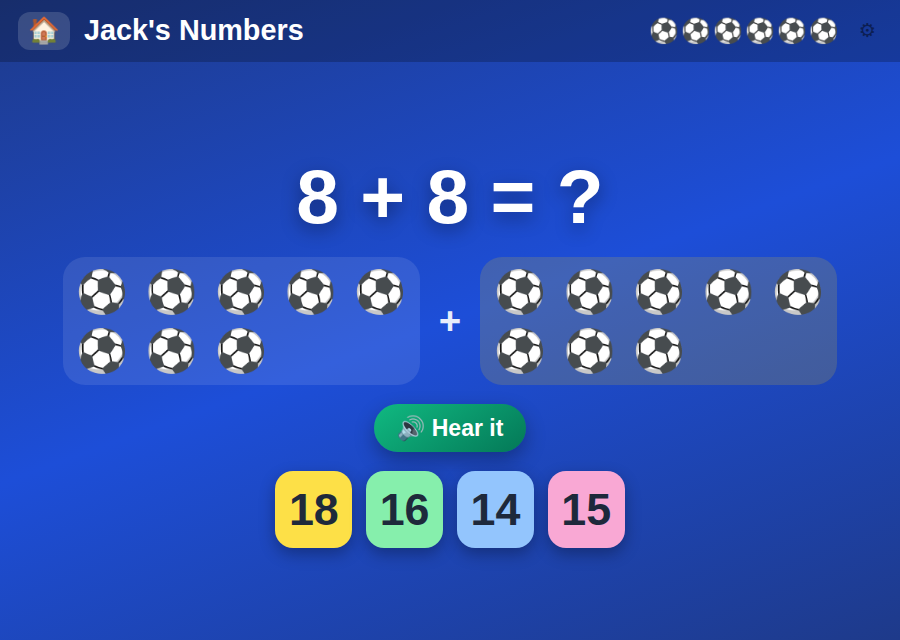

# 🔢 Jack's Numbers

**Count, add and subtract with footballs — to 10, then to 20**

[](https://jacks-games.github.io/numbers/)




## What this is

An early-years maths game — counting, addition and subtraction, first to 10 and then to 20.
Every sum is shown as **countable objects before it is shown as arithmetic**: the footballs are
there to be tapped one at a time, and each tap counts out loud and marks the ball with its
number. The abstract sum sits above them; the concrete quantity sits underneath.

Above ten, the balls are laid out **five to a row with a break after the tenth** — the ten-frame
representation used in Year 1 classrooms, which makes bridging ten something a child can see
rather than something they have to calculate.

## 🎮 How to play

### 1️⃣ &nbsp; Look at the footballs ⚽⚽⚽
The sum is made of real objects.

### 2️⃣ &nbsp; Touch them to count 👆
Each tap says **one, two, three…** and numbers the ball. Reaching the end clears the marks so
the same set can be counted again.

### 3️⃣ &nbsp; Pick the answer 🟨🟩🟦🟪
Four coloured tiles, one of them right.

### ⚽ &nbsp; GOAL!
A correct tile wins a football. A wrong one wobbles and the question is repeated — nothing is
lost and there is no timer.

## 📈 It grows with the child

| | |
|---|---|
| 🐣 **To 10** | counting 1–10, addition and subtraction within 10 |
| 🚀 **To 20** | switched on with ⚙ — counting to 20, addition bridging ten (8 + 8, 9 + 7), subtraction inside twenty (17 − 5) |

Turning the bigger range on **adds** levels after the existing ones rather than replacing them,
so nothing a child has already mastered suddenly gets harder.

```
⚽⚽⚽⚽⚽      twelve reads as
⚽⚽⚽⚽⚽      ten and two,
              not as a heap
⚽⚽
```

## 🎯 What it practises

- 🔢 &nbsp; One-to-one counting of visible objects
- ➕ &nbsp; Addition across the ten boundary
- ➖ &nbsp; Subtraction within twenty
- 🧠 &nbsp; Reading a quantity from a ten frame at a glance

## 🎈 The other games

| Game | What it is | |
|---|---|---|
| 📖 [**Jack's Words**](https://github.com/jacks-games/words) | Hear a word, build it from letter tiles, then read it in a sentence | [▶ play](https://jacks-games.github.io/words/) |
| 🥅 [**Jack's Match**](https://github.com/jacks-games/match) | Tell real words from decodable nonsense words, then spell by ear | [▶ play](https://jacks-games.github.io/match/) |
| ✏️ [**Jack's Letters**](https://github.com/jacks-games/letters) | Finger-trace all 26 lowercase letters in the correct stroke order | [▶ play](https://jacks-games.github.io/letters/) |
| 🔢 [**Jack's Numbers**](https://github.com/jacks-games/numbers) | Count, add and subtract with footballs — to 10, then to 20 | [▶ play](https://jacks-games.github.io/numbers/)  👈 **this one** |
| 🍎 [**Jack's Apples**](https://github.com/jacks-games/apples) | Trace 1–20, then fill the missing numbers into the apple grid | [▶ play](https://jacks-games.github.io/apples/) |
| ♟️ [**Jackies Schach**](https://github.com/jacks-games/chess) | Full FIDE rules with a coach that marks the safe squares (German) | [▶ play](https://jacks-games.github.io/chess/) |

All six on one start page: **[jackbenn.ing](https://jackbenn.ing)**

## 🛠 Built like this

Every game in this organisation is **one self-contained `index.html`** — no build step, no
framework, no package manager, no analytics, and no network calls once the page has loaded.
That is a deliberate constraint: a game a child depends on should still work in five years,
and a parent should be able to read the whole thing in one sitting.

- **Speech** — the browser's Web Speech API, preferring a British English voice. It always
  waits for a tap first, because Chrome and iOS block audio without user activation.
- **Progress** — kept in `localStorage` on the device. Nothing is collected, sent or stored
  anywhere else.
- **Made for** an iPad mini in either orientation: finger-sized targets, no hover-only
  interactions, `prefers-reduced-motion` respected.

Run it locally:

```bash
python3 -m http.server 8000
```

The start page at [jackbenn.ing](https://jackbenn.ing) is built from
[google814/Jack](https://github.com/google814/Jack), which is the source of truth. The repos
in this organisation are copies kept in step by `tools/sync-game-repos.sh` in that repo, so
each game also has its own page and its own link.
